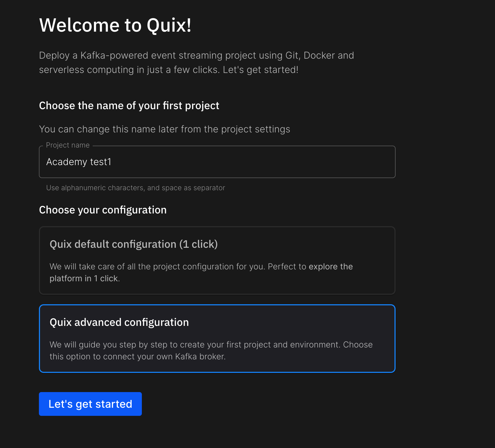
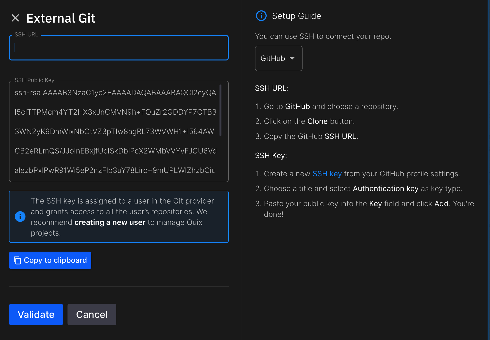

# Streaming Academy
This repo contains a code and instructions to support series of episodes of Streaming Academy. This series goal is to teach Data engineers and Software Engineers how to build and develop redistributed fault-tolerant streaming architectures using Kafka and Python. 

## Curriculum
1. Episode 1: Intro to stream processing
   - What is stream processing
   - Motivation
   - Landscape overview
   - Kafka fundamentals
     - Topics
     - Partitions
     - Consumer groups
     - Checkpointing
   - Quix Streams fundamentals
     - Application
     - DataFrame
     - Produce message
     - Creating transformation
     - Output DataFrame
     - Reprocessing
   - Practice part
     - Sign up
     - Create a project
     - Create an environment
     - Setting up GitHub codespaces
     - Creating Flask WebGateway producer
     - Building data normalization service
2. Episode 2: Stateful data transformations
   - Usecases
   - State fundamentals
   - Basic state operations
   - Windows
   - State recovery
   - Partition reaasigment
   - Changelog topics
   - Group By (repartition)
3. Episode 3: Application development
   - Common ways to integrate stream processing pipelines with end apps
   - WebAPI ingestion
   - WebSocket ingestion
   - WebSocket consumption
   - In-memory views
   - Consumer lag metrics
4. Episode 4: Realtime ML inference
   - Architecture introduction
   - Model training
   - Model deployment
   - Model KPIs
   - A/B testing

# Episode 1


## Create new repo in GitHub
Create new empty repository for your project in GitHub. 

You should end up on empty project screen like this:


## Sign up and create new project in Quix
This step is optional, and you can develop whole pipeline locally but we recommend to use QuixCloud trial for your first project so you don't have to spent time on local infrastructure installation (Kafka or Docker).

1. Sign up here: https://quix.io/signup
2. Specify `project name` and select **Quix advanced configuration**
   
   

3. Select **Connect your own Git repo**
   - Copy **SSH URL** from your new GitHub repo
   - Press **Copy to clipboard** button
   - Follow instruction on the right to add your **SSH key**

   

4. Create main branch and future prod environment
5. Finish tutorial by clicking next until project is created.

### Create dev environment
1. In QuixCloud, add **New environement**
2. Name it Episode1
3. Create new branch based on main called `ep1`
4. Click next until done


## Select your IDE
You can develop locally, or use any of managed online IDEs. For this tutorial we recommend using GitHub codespaces. 

### Create new GitHub CodeSpace
Go to your GitHub repo homepage and click code:


### Checkout dev branch
```git
git fetch
git checkout ep1
```

## Install Quix CLI
Quix CLI helps you to connect to your cloud infrastructure seamlessly as well as helps you with managing your pipeline locally. 

### Installation of Quix CLI

To install the Quix CLI, users have multiple methods depending on their operating system. Here's an expanded installation section including the main ways to install Quix CLI on Linux, macOS, and Windows.

#### For macOS:

- **Install latest version:**

  ```bash
  curl -fsSL https://github.com/quixio/quix-cli/raw/main/install.sh | sudo bash
  ```

#### For Linux:

- **Install latest version:**

    ```bash
    curl -fsSL https://github.com/quixio/quix-cli/raw/main/install.sh | sudo bash
    ```

#### For Windows (PowerShell):

- **Install latest version:**

  ```powershell
  iwr https://github.com/quixio/quix-cli/raw/main/install.ps1 -useb | iex
  ```

### Login
Pair your local CLI context with your Cloud account:
```
quix login
```

## Python VENV
Let's start with creating virtual environment for Python

```
python3 -m venv venv
source venv/bin/activate
```

## Let's start with demo data source
To simulate data source before we connect to real one, let's replay sample file with messages.  

### Create new service from template
```
quix local apps create demo-data-source -p raw-replay
cd raw-replay/
```
Then download sample data file: 
```
wget https://raw.githubusercontent.com/tomas-quix/streaming-academy/main/file-sink/demo_stream.json
```

### Edit service settings and code
Edit app.yaml to send data to raw topic:

```yaml
name: RAW data replay
language: Python
variables:
  - name: output
    inputType: OutputTopic
    description: Name of the output topic to write into
    defaultValue: raw-data
    required: true
dockerfile: dockerfile
runEntryPoint: main.py
defaultFile: main.py
```

### pip install
Install Raw replay Python dependencies specified in `requirements.txt`:
```
pip install -r requirements.txt 
```

change main.py to send data from `demo_stream.json`:

```python
from quixstreams import Application
import json
import time
import os

# import the dotenv module to load environment variables from a file
from dotenv import load_dotenv
load_dotenv(override=False)

# Create an Application.
app = Application.Quix()

# Define the topic using the "output" environment variable
topic_name = os.getenv("output", "")
if topic_name == "":
    raise ValueError("The 'output' environment variable is required. This is the output topic that data will be published to.")

topic = app.topic(topic_name)

with app.get_producer() as producer:
    with open("demo_stream.json", 'r') as file:
        for line in file:
            # Remove newline characters from the message
            message = json.loads(line.strip())
            
            # Publish message to Kafka
            producer.produce(topic.name, json.dumps(message), "demo_stream.json")

            print(message)
            time.sleep(1)

    producer.flush(30)  # Wait for all messages to be delivered
    print('All messages have been flushed to the Kafka topic')
```

### Running replay
Now last step is to run replay service and produce some sample data into `raw-data` topic so we can continue building our pipeline:

```
python3 main.py
```

#### Inspecting data
Go to https://portal.platform.quix.io/topics to check data in topics.


## Create Data normalization service

```
quix local apps create starter-transformation -p data-normalization
cd data-normalization
pip install -r requirements.txt
```

Open main.py and edit app definition to adjust our app for development:

```python
app = Application.Quix(str(uuid.uuid4()), auto_offset_reset="earliest", use_changelog_topics=False)

input_topic = app.topic(os.environ["input"])
#output_topic = app.topic(os.environ["output"])
```

and comment out output until we have output data in shape:

```
#sdf = sdf.to_topic(output_topic)
```

### Local environment preparation
In order to run your code against Quix Cloud infrastructure, we must sync our local environment with Quix Cloud.

Let's start selecting default project and environment by:

```
quix use
```
Now lets go to app.yaml and change input and output topics as following:

```yaml
name: data-normalization
language: Python
variables:
  - name: input
    inputType: InputTopic
    description: Name of the input topic to listen to.
    defaultValue: raw-data
    required: true
  - name: output
    inputType: OutputTopic
    description: Name of the output topic to write to.
    defaultValue: table-data
    required: true
dockerfile: dockerfile
runEntryPoint: main.py
defaultFile: main.py
```

then we create local `.env` file to inject environment variables into the runtime:
```
quix local vars export
```

This will create `.env` file:
```
Quix__Portal__Api=https://portal-api.platform.quix.io
Quix__Organisation__Id=tomas
Quix__Workspace__Id=tomas-streamingacademy-dev
Quix__Sdk__Token=sdk-749a76aeb6ea48d2b1b2d1abb6a3ca55
input=raw-data
output=table-data
```

These environment variables are then injected into the runtime because of these lines at the top of the `main.py`:
```python
from dotenv import load_dotenv
load_dotenv()
```

### Data normalization
As you can see in the example message, multiple sensors and multiple timestamps are included in one message from 


## Create Flask Web Gateway
This service is responsible to receive HTTP Post calls from our Sensor Logger app. 

Go to library, search for source *Flask Web Gateway* and add it to your project. Then deploy service with public access enabled.

After service is deployed, in deployment details you can copy url adress and set it in your sensor logger app. Example url: https://webgateway-tomas-streamingacademy-dev.deployments.quix.io